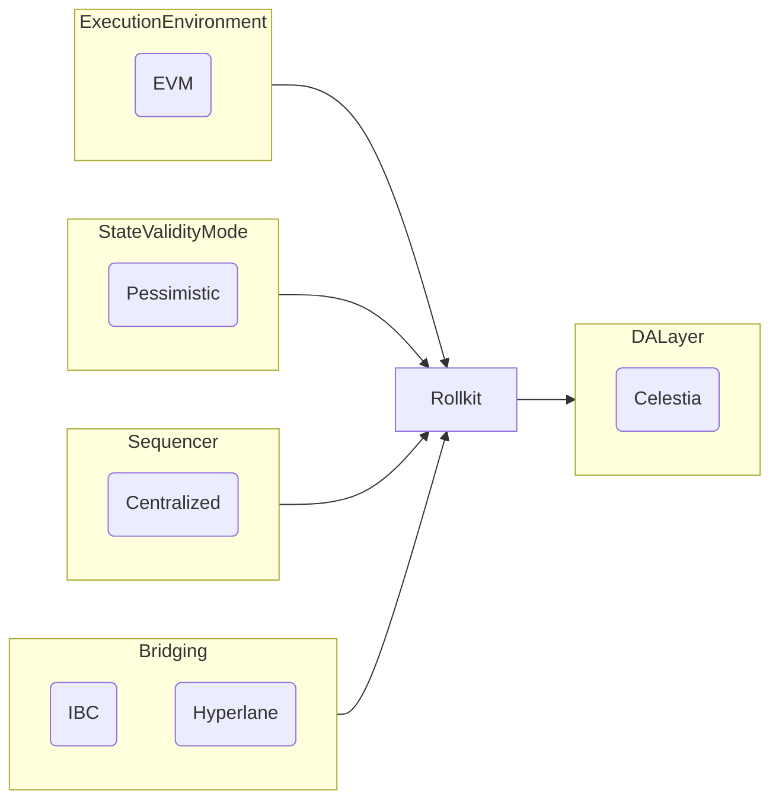

# Lazy Chain Proof of Concept

Proof on Concept (Local and Testnet using [kurtosis](https://docs.kurtosis.com/)) [Rollkit](https://rollkit.dev/learn/intro) with [Celestia](https://docs.celestia.org/) as DA and [Artela](https://docs.artela.network/develop) as EVM++.

## Architecture high level

## Contents

