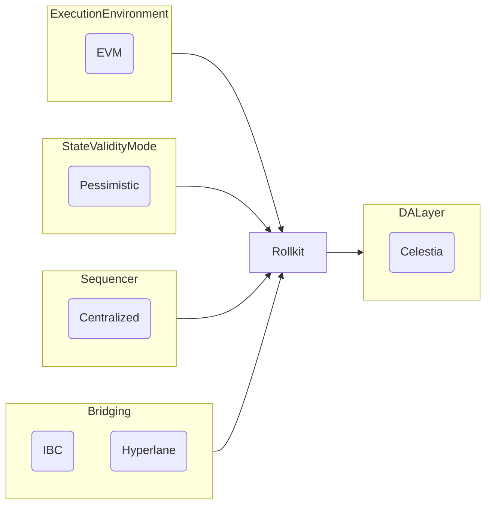

# Lazy Chain Proof of Concept

Proof on Concept (Local and Testnet using [kurtosis](https://docs.kurtosis.com/)) [Rollkit](https://rollkit.dev/learn/intro) with [Celestia](https://docs.celestia.org/) as DA and [Artela](https://docs.artela.network/develop) as EVM++.

## Architecture high level

## Analysis, Design and Prototyping

* [Analysis](./doc/analisys.md)
  * User Stories
    * NFT Transfer
    * Staking / Unstaking
* [Design](./doc/design.md)
  * UML and Tasks
    * Gas Bridge
    * NFT bridge to Lazy Chain
    * Stake
* [Prototyping](./doc//prototyping.md)

## ADR Table of Contents

### Accepted

* [ADR 001: Record Architecture Decisions](./doc/adr/0001-record-architecture-decisions.md)
* [ADR 002: Project Scope](./doc/adr/0002-project-scope.md)

### Proposed

### Draft

* [3. Oracle Sidecar](0003-oracle-sidecar.md)
* [4. Faucet](0004-faucet.md)
* [5. Explorer](0005-explorer.md)
* [6. Indexer](0006-indexer.md)
