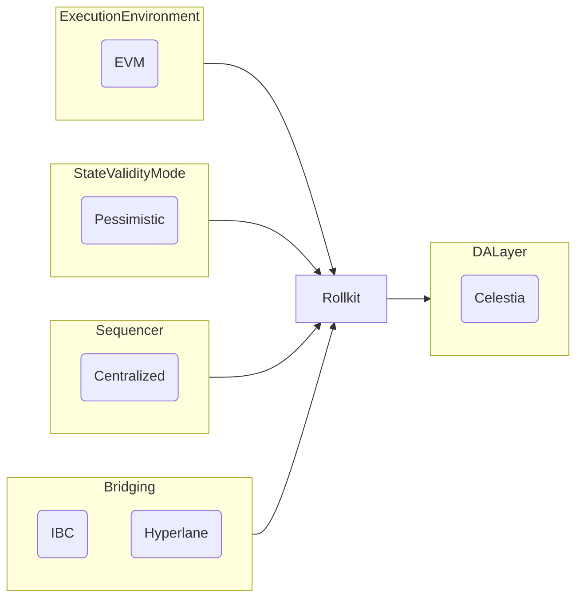

# Lazy Chain Proof of Concept

Proof on Concept (Local and Testnet using [kurtosis](https://docs.kurtosis.com/)) [Rollkit](https://rollkit.dev/learn/intro) with [Celestia](https://docs.celestia.org/) as DA and [Artela](https://docs.artela.network/develop) as EVM++.

## Links

- [Installation](./notes.md)
- [Security](./security.md)

## Architecture high level



## Test

### Install kurtosis

[kurtosis](https://docs.kurtosis.com/install/)

### Install bun

`curl -fsSL https://bun.sh/install | bash`

### Prepare

The following process will spawn a local infra compose by:

- A `lazychain` node: Artela Rollkit
- A `Stargaze` node: Cosmos blockchain
- A Hyperlane Bridge compose by a `Relayer` node and 2 validators nodes for `Lazychain` and `Stargaze` with all the contracts deployed and configured by the [setup](./src/static_files/hyperlane/)

We use 2 dummy wallets that are set up in the environment. These wallets are set up locally, no funds on real blockchain.

```bash
export HYP_KEY="arctic eagle supply pair melody ripple rigid bench suspect symbol image play web tobacco vessel kitchen mammal hard stamp spoon entire frown detail cherry"
export VAL_KEY="icon hospital stick paddle turn suspect gentle since raven sign chair raise super tiger seat six allow april praise school chaos movie gold yard"
```

Clone the repository and run the infra via kurtosis

```bash
git clone https://github.com/Lazychain/lazy_poc && cd lazy_poc
kurtosis clean --all && kurtosis run --enclave test . "$(echo { \"DEV_MNEMONIC\": $HYP_KEY, \"VAL_MNEMONIC\": $VAL_KEY})"
```

All the process is detailed on [notes](./notes.md)

```json
{
 "blockscout": {
  "explorer": "http://127.0.0.1:8080"
 },
 "forma": {
  "contracts": {},
  "dev_wallet": {
   "address": "0x4F10c018114F3d214f7CD1dEe06Bb06F54A076A0"
  },
  "grpc": "http://127.0.0.1:50051",
  "json-rpc": "http://127.0.0.1:8546",
  "validator_wallet": {
   "address": "0xaC21B97d35Bf75A7dAb16f35b111a50e78A72F30"
  },
  "ws": "http://127.0.0.1:8551"
 },
 "hyperlane": {
  "lazy-forma": {},
  "lazy-stargaze": {
   "config": {
    "chains": {
     "lazy": {
      "domainRoutingIsmFactory": "0xD781Da4ed84470B706f8C6F12a13fa134c5B3d8D",
      "interchainAccountIsm": "0x96B6441a375b0B13E86ba853A542a8D4f8bf0a20",
      "interchainAccountRouter": "0xf7583BdeCf840e60657dd175dc6Ec172269eb8E7",
      "mailbox": "0x067A44Af3D39893Bd783518F6b687d89aed8f9b7",
      "merkleTreeHook": "0x18a2fD5E2791f8D7A87BE15F203ef4840691cd64",
      "proxyAdmin": "0x41F84AB405621BA3560D3E76A2Ae8845568FaCB4",
      "staticAggregationHookFactory": "0xfda383d60569eEC89dC7712D831232B271F59382",
      "staticAggregationIsmFactory": "0x4Abd22724265745B1914816E44619357B5B4dE6B",
      "staticMerkleRootMultisigIsmFactory": "0xfbb15A5773F84cdAe31e60cB0A487381d8D0dC14",
      "staticMerkleRootWeightedMultisigIsmFactory": "0xB0E38fca16B0330e0106BA76433bbf371E716e01",
      "staticMessageIdMultisigIsmFactory": "0x397925Dbfbc3c42f4b3eFa5E11e9B8e7c2B39CC7",
      "staticMessageIdWeightedMultisigIsmFactory": "0x77c8D0636De274A1B84a7bBED3898e839485d3c4",
      "testRecipient": "0xC14d13977d92ce0d6BeEFfDD6EDA179d3F225380",
      "validatorAnnounce": "0x0715Ceaeeb3276516b3ae9061BE74F7cdc433780"
     },
     "stargaze": {
      "interchainGasPaymaster": "0x581ce22ef1ad28ffa1558fb6fa6e53904eef5e96efb7e7c96209a75e5d565c36",
      "mailbox": "0x9e28beafa966b2407bffb0d48651e94972a56e69f3c0897d9e8facbdaeb98386",
      "mailbox_cosmos": "stars1nc5tatafv6eyq7llkr2gv50ff9e22mnf70qgjlv737ktmt4eswrq096cja",
      "merkleTreeHook": "0xbf5c82d76d2d94d385331d28fd7eb68e3523ee8de846a8831ed95df7190bdb59",
      "validatorAnnounce": "0xf04a313a7349b120c55c99788f12f712176bb3e5926d012d0ea72fa2bbb85051",
      "validator_announce_cosmos": "stars17p9rzwnnfxcjp32un9ug7yhhzgtkhvl9jfksztgw5uh69wac2pgsh7yame"
     }
    }
   },
   "lazy_validator": {
    "grpc": "http://127.0.0.1:9120"
   },
   "relayer": {
    "grpc": "http://127.0.0.1:9110"
   },
   "stargaze_validator": {
    "grpc": "http://127.0.0.1:9121"
   }
  }
 },
 "lazy": {
  "contracts": {},
  "dev_wallet": {
   "address": "art1g6zqy2y7hft0cpat7sf6h70s5mdyag2a58d6cr",
   "balance": "[
  {
    "denom": "aart",
    "amount": "100000000000000000000"
  }
]
",
   "eth_addr": "312bb42931060d953513de5c1f658f54592bd82650e5a7a6b770d5149c56d86e"
  },
  "grpc": "http://127.0.0.1:9090",
  "json-rpc": "http://127.0.0.1:8545",
  "rest": "http://127.0.0.1:1317",
  "rpc": "http://127.0.0.1:26657",
  "validator_wallet": {
   "address": "art1fugvqxq3fu7jznmu680wq6asda22qa4qcvvy73"
  }
 },
 "stargaze": {
  "contracts": {
   "cw721_base": {
    "addr": "stars14hj2tavq8fpesdwxxcu44rty3hh90vhujrvcmstl4zr3txmfvw9srsl6sm",
    "code_id": "1"
   }
  },
  "dev_wallet": {
   "address": "stars1wj8h432p89c86fehty9xmwrnx78ttnrp0auwmq",
   "balance": "[
  {
    "denom": "ustars",
    "amount": "1000000000000000"
  }
]
",
   "eth_addr": "5743ea6ae7afa91cddc656318dfa8bd7c73e4fb73e858fb7eceee171e10ceeff"
  },
  "grpc": "http://127.0.0.1:8090",
  "rest": "http://127.0.0.1:1316",
  "rpc": "http://127.0.0.1:21657",
  "validator_wallet": {
   "address": "stars1kjsltyrp8h8f5yz7vmd4d33vunw66tnah7gpt8"
  }
 }
}

```

### Checks

Once you get the response from the kurtosis it will display the nodes and ports to be used.
You can do the following checks:

lazy:

- rpc: `curl --silent localhost:26657/status | jq .result.node_info.network` : "artroll_11820-1"
- json-rpc: `curl --silent http://127.0.0.1:8545 -X POST -H "Content-Type: application/json" --data '{"jsonrpc":"2.0","method":"net_version","params":[],"id":67}' | jq .result` : "11820"
- json-rpc: `cast client -r http://127.0.0.1:8545` : `<appd>//linux-amd64/go1.22.8`
- grpc: `grpcurl -plaintext 127.0.0.1:8090 list` should response

stargaze:

- rpc: `curl localhost:21657/status | jq .` should response
- grpc: `grpcurl -plaintext 127.0.0.1:8090 list` should response
- rest: `curl --silent http://localhost:1316/cosmos/base/tendermint/v1beta1/blocks/latest | jq .block.header.chain_id` "testing"

Balance:

- balance: `cast balance 0x468402289EbA56fC07aBf413aBF9f0a6Da4Ea15D` : "100000000000000000000"
- balance: `curl --location http://localhost:1316/cosmos/bank/v1beta1/balances/stars1cmxt3mt7vfcncs64ycsgjvep7xecv0grsr47p3 | jq .balances[0]`

Wallets:

```bash
cd sdk
bun run src/index.ts wallet recover "$(echo $HYP_KEY)"
```

```bash
cd sdk
bun run src/index.ts wallet balance 0x468402289EbA56fC07aBf413aBF9f0a6Da4Ea15D
```

### Test the hyperlane bridge

1- Deploy, init and send a `receipt` message from `lazy` chain to `stargaze`.

```bash
cd sdk
bun run src/index.ts test-dispatch-eth "lazy" "$(echo $HYP_KEY)"
```

```md
http://localhost:8545
[SUCCESS] [test-dispatch] Receipt sent
[test-dispatch] ism addr[0x397925Dbfbc3c42f4b3eFa5E11e9B8e7c2B39CC7]
[test-dispatch] mailbox addr[0x067A44Af3D39893Bd783518F6b687d89aed8f9b7]
[NOTICE] [test-dispatch] smart contract receipt addr[0x911361aB56F5961BA45884be01Ec1986e836921C]
```

2 - Check the received `receipt`

Using the `lazy` receipt addr[0x911361aB56F5961BA45884be01Ec1986e836921C] run:

```bash
cd sdk
bun run src/index.ts test-dispatch-cosmos "0x911361aB56F5961BA45884be01Ec1986e836921C" "stargaze" "$(echo $HYP_KEY)"
```

We are working to fix this:

```text
[INFO] [config] getSigningClient [stargaze]
[INFO] [config] Signer Addr[stars1wj8h432p89c86fehty9xmwrnx78ttnrp0auwmq] ETH[c1ffe94c2436f360c5a92477d25287e4e02ad97d] PubKey[03da6e56b80f812d5a93fb2c0e76f40569646f5a55bc137ba5e91b2b12801b718a]
[{"amount":"10000000","denom":"ustars"}]
receipt[0x911361aB56F5961BA45884be01Ec1986e836921C]
destDomain[11820]
mailbox[stars1nc5tatafv6eyq7llkr2gv50ff9e22mnf70qgjlv737ktmt4eswrq096cja]
msg: {
  "mailbox": {
    "default_hook": {}
  }
}
default_hook= stars1vhndln95yd7rngslzvf6sax6axcshkxqpmpr886ntelh28p9ghuqrjwdrx
cosmos -> eth : [stars1vhndln95yd7rngslzvf6sax6axcshkxqpmpr886ntelh28p9ghuqrjwdrx] -> [65e6dfccb4237c39a21f1313a874dae9b10bd8c00ec2339f535e7f751c2545f8]
msg: {
  "hook": {
    "quote_dispatch": {
      "sender": "stars1wj8h432p89c86fehty9xmwrnx78ttnrp0auwmq",
      "msg": {
        "dest_domain": 11820,
        "recipient_addr": "65e6dfccb4237c39a21f1313a874dae9b10bd8c00ec2339f535e7f751c2545f8",
        "msg_body": "68656c6c6f"
      }
    }
  }
}
fees=[
  {
    "denom": "ustars",
    "amount": "1000"
  }
]
{
  "dispatch": {
    "dest_domain": 11820,
    "recipient_addr": "000000000000000000000000911361aB56F5961BA45884be01Ec1986e836921C",
    "msg_body": "68656c6c6f"
  }
}
funds: [
  {
    "amount": "10000000",
    "denom": "ustars"
  }
]
[INFO] [config] senderAddress=stars1wj8h432p89c86fehty9xmwrnx78ttnrp0auwmq
113 |             data: request,
114 |             prove: false,
115 |             height: desiredHeight,
116 |         });
117 |         if (response.code) {
118 |             throw new Error(`Query failed with (${response.code}): ${response.log}`);
                        ^
error: Query failed with (6): rpc error: code = Unknown desc = failed to execute message; message index: 0: dispatch: submessages: dispatch: submessages: No funds sent: execute wasm contract failed [CosmWasm/wasmd@v0.45.0/x/wasm/keeper/keeper.go:395] With gas wanted: '50000000' and gas used: '961480' : unknown request
```
