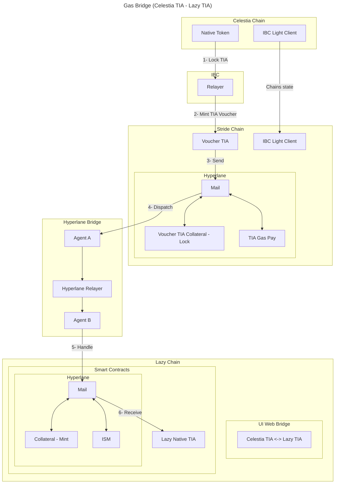
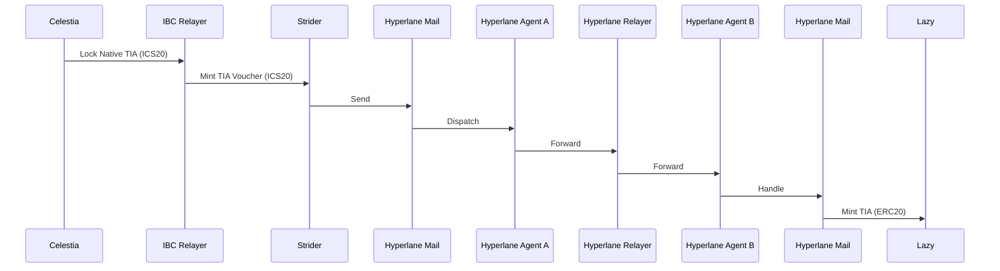

# 3. Base token

Date: 2024-09-27

## Status

Draft

## Context

We need to pay Gas Fee for using the Data Availability layer (Celestia). For the release of this new, we cannot use **IBC** since **ibc light clients** can't check proofs is the blockchain is not an L1.

## Decision

We are going to use [Hyperlane bridge](https://docs.hyperlane.xyz/docs/intro) to transfer TIA from Celestia to our new blockchain.

Hyperlane uses **IBC** to transfer **TIA** (ICS Native token) into a Hyperlane **Voucher TIA** ([ICS-20](https://github.com/cosmos/ibc/blob/main/spec/app/ics-020-fungible-token-transfer/README.md)).
Later we can bridge (lock hyperlane voucher TIA) the TIA tokens into this new chain (mint [EIP-20](https://eips.ethereum.org/EIPS/eip-20))

### Gas Bridge (Celestia TIA - Lazy TIA)

### Tasks

- Lazy TIA **ERC20** smart contract using Solidity
  - Receive ok / Refund is handle by Hyperlane bridge?
- Define warp routes for Hyperlane Bridge
  - [deploy-warp-route](https://docs.hyperlane.xyz/docs/guides/deploy-warp-route})
  - [Submit to Registry](https://github.com/changesets/changesets/blob/main/docs/adding-a-changeset.md)
- Create a Bridge UI
  - [deploy-warp-route-UI](https://docs.hyperlane.xyz/docs/guides/deploy-warp-route-UI#fork--customize-the-ui)
  - [Example](https://github.com/forma-dev/hyperlane-bridge-ui)

## Consequences

- This make Celestia the default DA layer.
- Out TIA token would be [ERC20](https://eips.ethereum.org/EIPS/eip-20).
