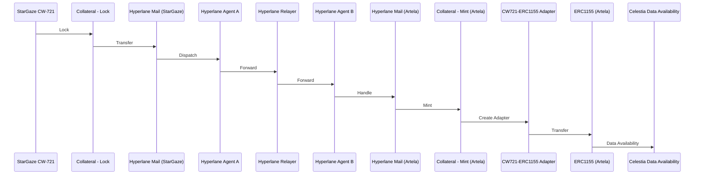
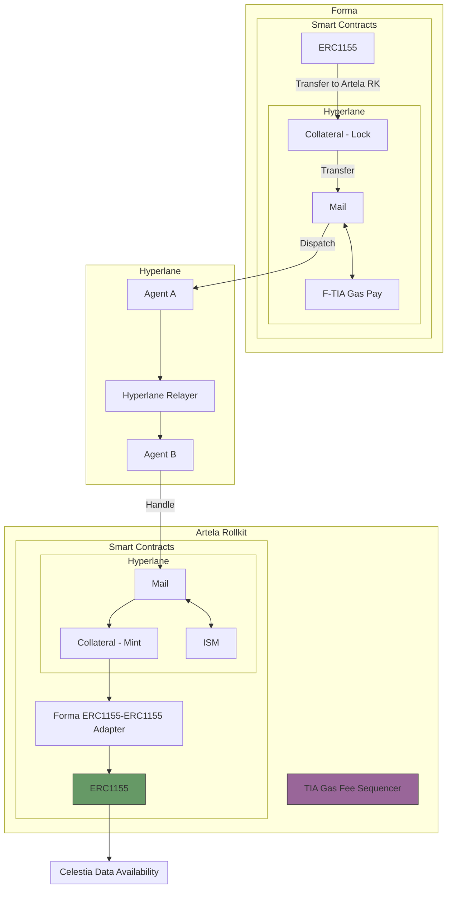
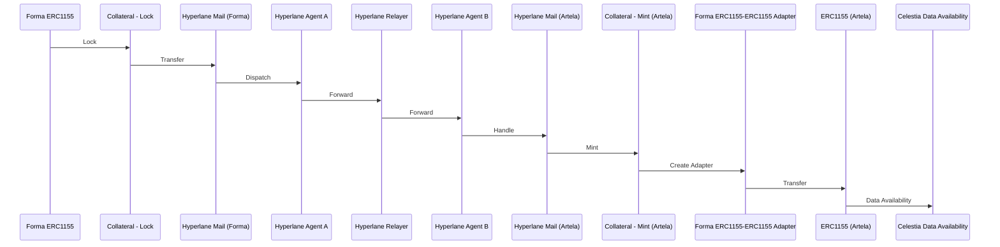

# 4. NFT Transfer

Date: 2024-09-27

## Status

Draft

## Context

We need to move NFT collections from Forma and StarGaze blockchains and store them in the Data Availability layer (Celestia).
In both cases we need to use Hyperlane bridge, but the NFT schemas are different, the first one Forma is a [ERC721](https://github.com/forma-dev/sdk/tree/main/contracts) while the second one StarGaze is a [ICS721](https://github.com/cosmos/ibc/blob/main/spec/app/ics-721-nft-transfer/README.md)

## Decision

Our blockchain is going to work with [EIP-1155](https://eips.ethereum.org/EIPS/eip-721)

### Comparison between EIP-721 and EIP-1155

- ERC-20 require deployment of separate contracts per token type.
- ERC-721 standard’s token ID is a single non-fungible index and the group of these non-fungibles is deployed as a single contract with settings for the entire collection.
- ERC-1155 Multi Token Standard allows for each token ID to represent a new configurable token type, which may have its own metadata, supply and other attributes.

|       Feature        |            EIP-721            |          EIP-1155          |
|:-------------------: |:----------------------------: |:-------------------------: |
| Token type           | Non-fungible (one-of-a-kind)  | Fungible and non-fungible  |
| Ownership            | Single ownership              | Multiple owners possible   |
| Transfers            | One token at a time           | **Batch transfers supported**  |
| Contract complexity  | Simpler                       | More complex               |

### NFT Transfer from StarGaze

## **Stargaze Tasks**

- Lazy TIA **ERC1155** smart contract using Solidity
  - [Forma 721](https://github.com/forma-dev/sdk/tree/main/contracts)
  - Receive ok / Refund is handle by Hyperlane bridge?
- Define warp routes for Hyperlane Bridge
  - [deploy-warp-route](https://docs.hyperlane.xyz/docs/guides/deploy-warp-route})
  - [Submit to Registry](https://github.com/changesets/changesets/blob/main/docs/adding-a-changeset.md)
- Create a Bridge UI for NFT
  - [deploy-warp-route-UI](https://docs.hyperlane.xyz/docs/guides/deploy-warp-route-UI#fork--customize-the-ui)
  - [Example](https://github.com/forma-dev/hyperlane-bridge-ui)

### NFT Transfer from FORMA

### **Forma Tasks**

- Lazy TIA **ERC1155** smart contract using Solidity
  - [Forma 721](https://github.com/forma-dev/sdk/tree/main/contracts)
  - Receive ok / Refund is handle by Hyperlane bridge?
- Define warp routes for Hyperlane Bridge
  - [deploy-warp-route](https://docs.hyperlane.xyz/docs/guides/deploy-warp-route})
  - [Submit to Registry](https://github.com/changesets/changesets/blob/main/docs/adding-a-changeset.md)
- Create a Bridge UI for NFT
  - [deploy-warp-route-UI](https://docs.hyperlane.xyz/docs/guides/deploy-warp-route-UI#fork--customize-the-ui)
  - [Example](https://github.com/forma-dev/hyperlane-bridge-ui)

## Consequences

We will adopt [EIP1155](https://eips.ethereum.org/EIPS/eip-1155) as nft specs.
