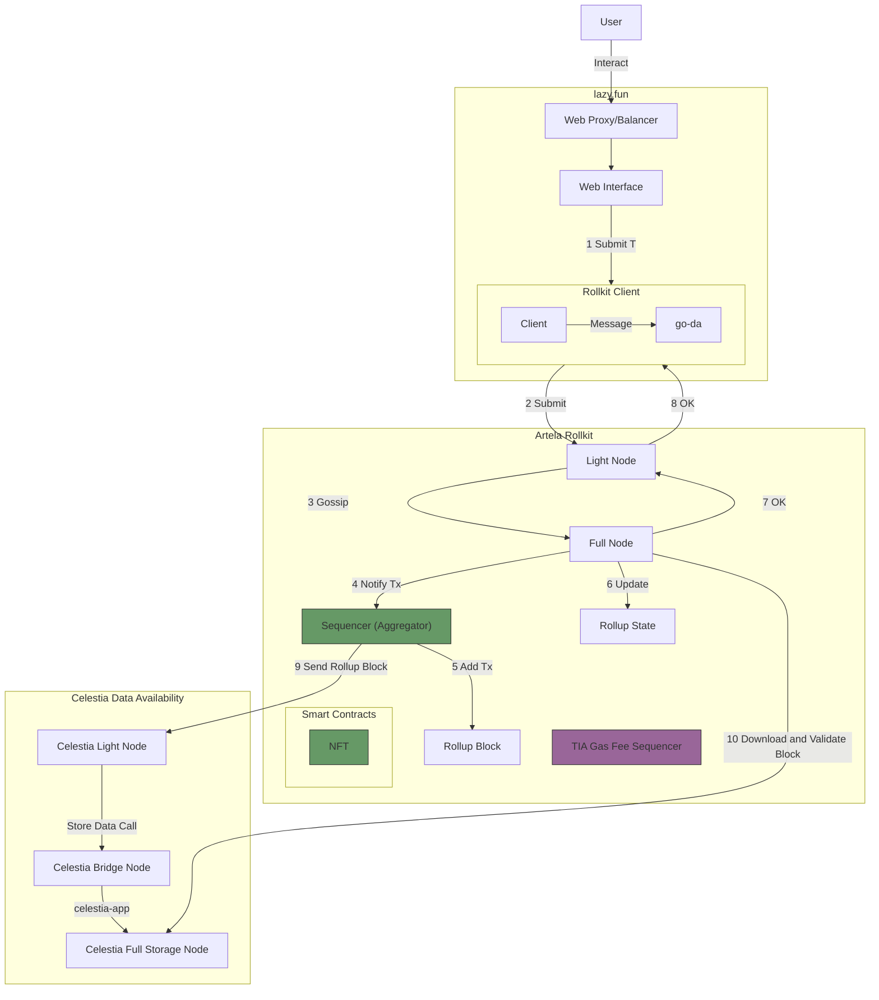
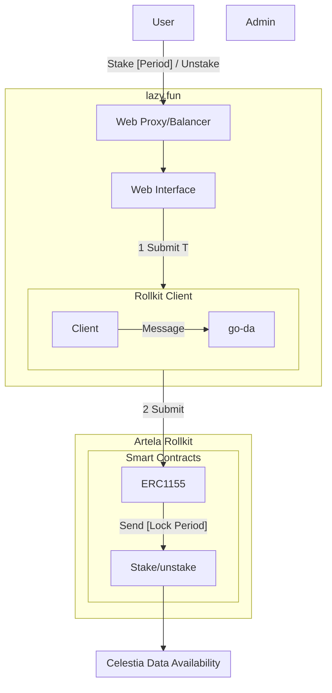
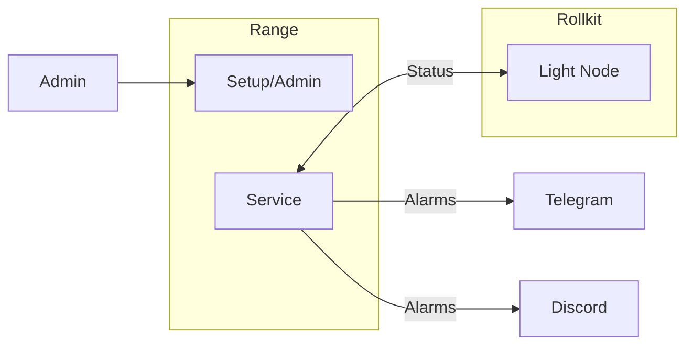

# Design

## Context

Celestine Sloth Society wants to have his own blockchain to evolve his main product NFT collection.
We are going to use a **modular blockchain** using **Sovereign Rollups** using Artela EVM++ as **Execution Layer**, **Rollkit** as **Settlement and consensus** layer (**cometBFT**) and **Celestia** as **Data Availability** layer.

## Main Goal

- Create a **modular blockchain** using **Sovereign Rollups** using Artela EVM++ as **Execution Layer**, **Rollkit** as **Settlement and consensus** layer (**cometBFT**) and **Celestia** as **Data Availability** layer.
- Transfer NFT Collections from other blockchains.
- Allow users to Stake their NFT.

## Sub Goals

- The system should be distributed, secure and scalable.

### Links

- [Forma Bridge](https://www.stride.zone/blog/stride-s-hyperlane-bridge-deployment-is-live-bridge-tia-to-forma)
- [Forma sdk](https://github.com/forma-dev/sdk/tree/main/contracts)
- [Celestia](https://celestia.org/what-is-celestia/)
- [RollKit](https://rollkit.dev/tutorials/artela-evm-plus-plus)
- [Hyperlane](https://docs.hyperlane.xyz/docs/deploy-hyperlane)
- [Artela](https://docs.artela.network/develop)

### Design ADRs

- [Gas Bridge (Celestia TIA - Lazy TIA)](adr/0003-base-token.md)
- [NFT Transfer](adr/0004-nft-transfer.md)
  
#### Data Availability Flow



> [!IMPORTANT]
> Add sequence diagram
> Research what tasks do we need here?

#### NFT ERC1155

> [!IMPORTANT]
> Add functions flowchart

#### STAKE



> **Tasks**

- Solidity Smart contract [cw-nft-staking](https://github.com/Lazychain/cw-nft-staking)
- Web UI [nft-staking-app](https://github.com/thirdweb-example/nft-staking-app)

#### Monitoring



> **Tasks**

- Create account into Range
- Setup Telegram and Discord Alarms
- Setup Service backend (RPC)

#### Oracle Sidecar

- [oracle-client](https://docs.skip.build/connect/developers/integration#oracle-client)

```mermaid
flowchart LR
```

> **Tasks**

#### Faucet

- [faucet-frontend](https://github.com/artela-network/faucet-frontend)

```mermaid
flowchart LR
```

#### Explorer

- [block-explorer](https://github.com/artela-network/block-explorer)
- [block-explorer-frontend](https://github.com/artela-network/block-explorer-frontend)

```mermaid
flowchart LR
```

#### Dashboard

- [evm-dashboard](https://github.com/artela-network/evm-dashboard)
