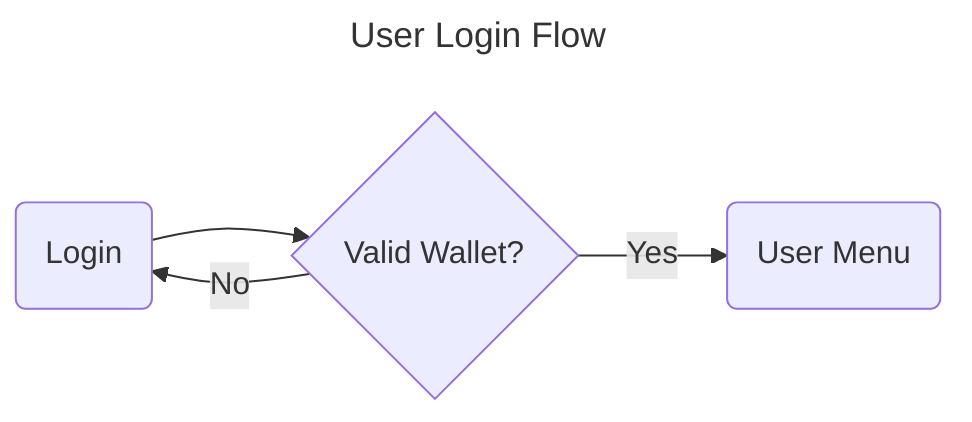

# 1. User Login



```gherkin
Feature: User Login
  As a user
  I want to be able to log in with valid credentials
  So that I can access the system

Scenario: Valid login
  Given I have provided valid username and password
  When I submit the login form
  Then I should see the Books Selection Flow page

Scenario: Invalid login
  Given I have provided invalid username or password
  When I submit the login form
  Then I should be prompted to re-enter my credentials
  And I will not see the Books Selection Flow page
```

- [Acceptance Criteria](ac/0001-user-login.md)
