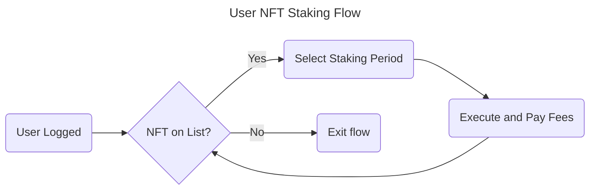

# 3. User NFT Staking Flow

```mermaid
---
title: User NFT Staking Flow
---
flowchart LR
    A(User Logged) --> B{NFT on List?}
    B --> |Yes| C(Select Staking Period)
    C --> D(Execute and Pay Fees)
    D --> B    
    B --> |No| X(Exit flow)
```

> [!IMPORTANT]
> Add gherkin scenarios
