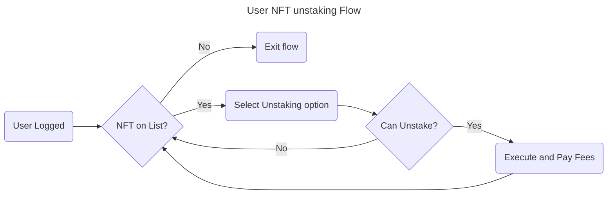

# 4. User NFT Unstaking Flow

```mermaid
---
title: User NFT unstaking Flow
---
flowchart LR
    A(User Logged) --> B{NFT on List?}
    B --> |No| X(Exit flow)
    B --> |Yes| C(Select Unstaking option)
    C --> D{Can Unstake?}
    D --> |Yes| E(Execute and Pay Fees)
    E --> B
    D --> |No| B  
```

> [!IMPORTANT]
> Add gherkin scenarios
